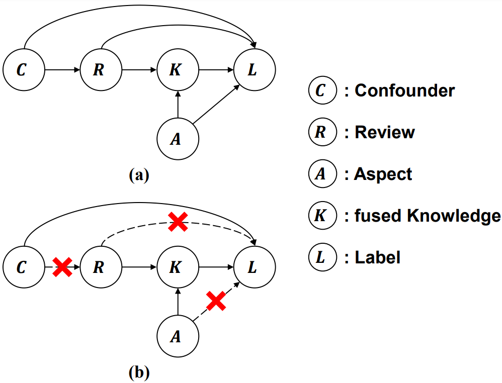
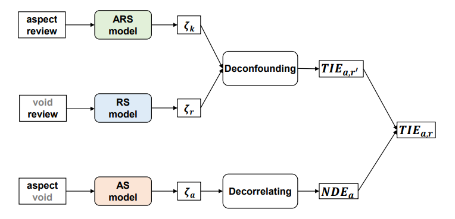

# DINER: Debiasing Aspect-based Sentiment Analysis with Multi-variable Causal Inference
## Overall
The SCM of ABSA, which is formulated as a directed acyclic graph, is shown in (a). With the SCM defined, we can derive the formula of causal effect. 
As shown in (b), the desired situation for ABSA is that the edges that bring biases are all blocked.

 

We present a novel debiasing framework, DINER, for multi-variable causal inference. 

 

